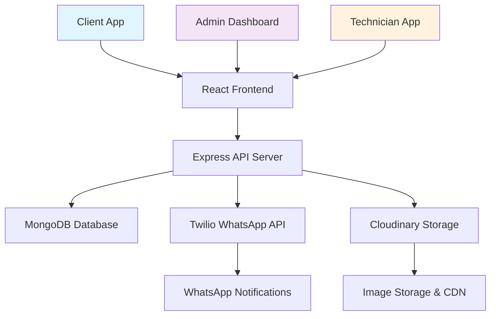

<div align="center">

# 🔧 CMS
### Professional Complaint Management System

[](https://reactjs.org/)
[](https://nodejs.org/)
[](https://mongodb.com/)
[](https://tailwindcss.com/)
[](https://www.twilio.com/whatsapp)

*Streamline your complaint management with WhatsApp OTP authentication, real-time updates, and intelligent assignment system*

[🚀 Demo](#demo) • [📖 Features](#features) • [⚡ Quick Start](#quick-start) • [📚 Documentation](#api-documentation) • [🤝 Contributing](#contributing)

</div>

---

## 🌟 Overview

**CMS** is a comprehensive, modern complaint management system designed for organizations that need efficient service request handling. Built with cutting-edge technologies, it provides a seamless experience for clients, technicians, and administrators while ensuring security and scalability.

### ✨ What Makes CMS Special?

- 🔐 **WhatsApp OTP Authentication** - No passwords, just secure phone-based login
- 📱 **Real-time Notifications** - Keep everyone informed via WhatsApp
- 🎯 **Smart Assignment** - Automatic technician assignment with load balancing
- 📊 **Role-based Dashboards** - Tailored interfaces for each user type
- 🌙 **Dark/Light Themes** - Beautiful UI that adapts to user preference
- 📸 **Photo Support** - Visual complaint documentation with Cloudinary
- 🔄 **Auto-assignment** - Intelligent distribution of workload

---

## 🎯 Features

### 🔐 **Advanced Authentication System**
- **WhatsApp OTP Login** for all user roles
- **JWT-based Security** with role-specific token expiration
- **Session Management**: Admin (permanent), Client/Technician (10 days)
- **Multi-role Support** with the same phone number for development

### 👥 **Three Distinct User Roles**

<details>
<summary><strong>🛠️ Client Portal</strong></summary>

- **Smart Dashboard** with real-time statistics
- **Complaint Creation** with rich text and photo upload (up to 5 images)
- **Real-time Tracking** of complaint status
- **Edit/Delete** pending complaints
- **Complete History** of all submitted complaints
- **Photo Gallery** with full-size viewing and download
- **Status Notifications** via WhatsApp

</details>

<details>
<summary><strong>👨‍💼 Admin Control Center</strong></summary>

- **System Overview** with comprehensive analytics
- **Complaint Management** with advanced filtering
- **User Management** (clients and technicians)
- **Assignment Control** with technician selection
- **Performance Metrics** and reporting
- **Bulk Operations** for efficient management
- **Real-time Monitoring** of system health

</details>

<details>
<summary><strong>🔧 Technician Workspace</strong></summary>

- **Assignment Dashboard** with priority sorting
- **Status Updates** (Start Work → Mark Complete)
- **Client Information** access
- **Photo Documentation** viewing
- **Work Progress** tracking
- **Notes Addition** for service records

</details>

### 📱 **Real-time Communication**
- **WhatsApp Integration** for all notifications
- **Assignment Alerts** to clients and technicians
- **Progress Updates** throughout the service lifecycle
- **Status Change** notifications in real-time

### 🔄 **Intelligent Assignment System**
- **Manual Assignment** by administrators
- **Auto-assignment** to available technicians
- **Round-robin Distribution** for balanced workload
- **Priority-based** routing for urgent complaints

---

## 🛠️ Tech Stack

<div align="center">

### Frontend


### Backend


### Services


</div>

---

## ⚡ Quick Start

### 📋 Prerequisites

Before you begin, ensure you have:

- **Node.js** (v16 or higher) - [Download](https://nodejs.org/)
- **MongoDB** - [Install locally](https://docs.mongodb.com/manual/installation/) or use [MongoDB Atlas](https://www.mongodb.com/cloud/atlas)
- **Twilio Account** - [Sign up](https://www.twilio.com/try-twilio) for WhatsApp API
- **Cloudinary Account** - [Register](https://cloudinary.com/users/register/free) for image storage

### 🚀 Installation

#### 1️⃣ Clone the Repository
```bash
git clone https://github.com/yourusername/CMS.git
cd CMS
```

#### 2️⃣ Backend Setup
```bash
cd backend
npm install
```

Create `.env` file in the backend directory:
```env
# Database Configuration
MONGODB_URI=mongodb://localhost:27017/cms_db

# JWT Security Keys
JWT_SECRET=your_super_secret_jwt_key_make_it_very_long_and_complex_for_security
JWT_ADMIN_SECRET=different_admin_jwt_secret_key_for_enhanced_security

# Twilio WhatsApp Configuration
TWILIO_ACCOUNT_SID=your_twilio_account_sid_from_console
TWILIO_AUTH_TOKEN=your_twilio_auth_token_from_console
TWILIO_PHONE_NUMBER=+14155238886
TWILIO_WHATSAPP_NUMBER=whatsapp:+14155238886

# Cloudinary Configuration
CLOUDINARY_CLOUD_NAME=your_cloudinary_cloud_name
CLOUDINARY_API_KEY=your_cloudinary_api_key
CLOUDINARY_API_SECRET=your_cloudinary_api_secret

# Server Configuration
PORT=5000
NODE_ENV=development
FRONTEND_URL=http://localhost:5173
```

Start the backend server:
```bash
npm run dev
```

#### 3️⃣ Frontend Setup
```bash
cd ../frontend
npm install
npm run dev
```

### 🎉 Access the Application
Open your browser and navigate to: **http://localhost:5173**

---

## 📱 Twilio WhatsApp Setup

### 🧪 Development (Sandbox)

For development and testing:

1. **Join Twilio Sandbox**:
   - Go to [Twilio Console](https://console.twilio.com/) → Messaging → Try WhatsApp
   - Send `join <your-sandbox-keyword>` to **+1 (415) 523-8886**
   - Use the sandbox number in your `.env` file

2. **Test with Same Number**:
   - All three roles (Client, Admin, Technician) can use the same phone number
   - Perfect for development and testing scenarios

### 🏢 Production Setup

<details>
<summary><strong>📈 Upgrade to Production WhatsApp API</strong></summary>

#### Step 1: Business Verification
- Verify your business with Twilio
- Provide business documentation
- Complete Facebook Business Manager setup

#### Step 2: Request WhatsApp Access
- Navigate to Console → Messaging → Senders → WhatsApp senders
- Click "Request Access"
- Fill out the business verification form
- Wait for approval (1-3 business days)

#### Step 3: Pricing Structure (2024)
- **Conversation-based**: $0.005-$0.055 per conversation
- **Template messages**: Free (limited templates)
- **Session messages**: $0.005-$0.055 (country-dependent)
- **No monthly fees** for standard usage

#### Step 4: Production Credentials
```env
TWILIO_WHATSAPP_NUMBER=whatsapp:+your_verified_business_number
```

</details>

---

## 📚 API Documentation

### 🔐 Authentication Endpoints

| Method | Endpoint | Description |
|--------|----------|-------------|
| `POST` | `/api/auth/send-otp` | Send OTP to phone number |
| `POST` | `/api/auth/verify-otp` | Verify OTP and authenticate |
| `GET` | `/api/auth/me` | Get current user profile |

### 🎫 Client Complaint Management

| Method | Endpoint | Description |
|--------|----------|-------------|
| `POST` | `/api/complaints` | Create new complaint with photos |
| `GET` | `/api/complaints/my-complaints` | Get user's complaints |
| `GET` | `/api/complaints/:id` | Get complaint details |
| `PUT` | `/api/complaints/:id` | Update complaint (pending only) |
| `DELETE` | `/api/complaints/:id` | Delete complaint (pending only) |

### 🔧 Technician Operations

| Method | Endpoint | Description |
|--------|----------|-------------|
| `GET` | `/api/complaints/technician/assigned` | Get assigned complaints |
| `PATCH` | `/api/complaints/:id/status` | Update complaint status |

### 👨‍💼 Admin Management

| Method | Endpoint | Description |
|--------|----------|-------------|
| `GET` | `/api/admin/dashboard/stats` | System statistics |
| `GET` | `/api/admin/complaints` | All complaints with filters |
| `POST` | `/api/admin/complaints/assign` | Assign complaint to technician |
| `GET` | `/api/admin/clients` | Client management |
| `GET` | `/api/admin/technicians` | Technician management |
| `PATCH` | `/api/admin/users/:id/toggle-status` | Enable/disable users |
| `DELETE` | `/api/admin/users/:id` | Delete user account |

---

## 🏗️ System Architecture



### 📁 Project Structure

```
CMS/
├── 📁 backend/
│   ├── 📁 config/
│   │   ├── 🗄️ database.js      # MongoDB connection
│   │   ├── ☁️ cloudinary.js     # Image storage config
│   │   └── 📱 twilio.js         # WhatsApp API config
│   ├── 📁 controllers/
│   │   ├── 🔐 authController.js
│   │   ├── 🎫 complaintController.js
│   │   └── 👨‍💼 adminController.js
│   ├── 📁 middleware/
│   │   ├── 🛡️ auth.js           # JWT authentication
│   │   └── 📤 upload.js         # File upload handling
│   ├── 📁 models/
│   │   ├── 👤 User.js           # User schema
│   │   ├── 🎫 Complaint.js      # Complaint schema
│   │   └── 🔢 OTP.js           # OTP schema
│   ├── 📁 routes/
│   │   ├── 🔐 authRoutes.js
│   │   ├── 🎫 complaintRoutes.js
│   │   └── 👨‍💼 adminRoutes.js
│   └── 🚀 server.js             # Main server file
├── 📁 frontend/
│   ├── 📁 src/
│   │   ├── 📁 components/
│   │   │   ├── 🔐 auth/         # Authentication components
│   │   │   ├── 🖼️ layout/       # Layout components
│   │   │   └── 🧩 common/       # Reusable components
│   │   ├── 📁 pages/
│   │   │   ├── 🛠️ client/       # Client dashboard & forms
│   │   │   ├── 👨‍💼 admin/        # Admin management pages
│   │   │   └── 🔧 technician/   # Technician workspace
│   │   ├── 📁 context/
│   │   │   └── 🎨 ThemeContext.jsx
│   │   ├── 📁 store/
│   │   │   └── 🗄️ authStore.js   # Global state management
│   │   └── 🎯 App.jsx           # Main application
│   └── 📋 package.json
└── 📖 README.md
```

---

## 🔒 Security Features

- 🛡️ **JWT Authentication** with role-based access control
- 🔐 **Input Validation** and sanitization on all endpoints
- ⚡ **Rate Limiting** to prevent API abuse
- 🌐 **CORS Configuration** for secure cross-origin requests
- 📁 **Secure File Uploads** with type and size validation
- 🔑 **Environment Variables** for sensitive data protection
- 🕒 **Token Expiration** with different durations per role

---

## 🎨 UI/UX Features

- 🌙 **Dark/Light Theme** toggle with system preference detection
- 📱 **Responsive Design** that works on all devices
- ✨ **Smooth Animations** with Framer Motion
- 🎯 **Intuitive Navigation** with role-based menus
- 📊 **Interactive Dashboards** with real-time data
- 🖼️ **Image Gallery** with zoom and download functionality
- 🔍 **Advanced Filtering** and search capabilities

---

## 🚀 Usage Guide

### 👨‍💻 For Developers

1. **Start both servers**:
   ```bash
   # Terminal 1 - Backend
   cd backend && npm run dev
   
   # Terminal 2 - Frontend
   cd frontend && npm run dev
   ```

2. **Access the application** at `http://localhost:5173`

3. **Choose your role** and login with your test phone number

### 🛠️ For Clients

1. **Select "Client"** on the role selection page
2. **Login** with your phone number
3. **Create complaints** with detailed descriptions and photos
4. **Track progress** in real-time
5. **Receive updates** via WhatsApp

### 👨‍💼 For Administrators

1. **Select "Admin"** on the role selection page
2. **Access the admin dashboard** for system overview
3. **Manage complaints** and assign to technicians
4. **Monitor user activity** and system performance
5. **Generate reports** and analytics

### 🔧 For Technicians

1. **Select "Technician"** on the role selection page
2. **View assigned complaints** on your dashboard
3. **Update status** as you progress through tasks
4. **Add notes** and documentation
5. **Mark complaints complete** when resolved

---

## 🤝 Contributing

We welcome contributions from the community! Here's how you can help:

### 🐛 Bug Reports
- Use the [GitHub Issues](https://github.com/yourusername/CMS/issues) page
- Include detailed steps to reproduce
- Provide environment information

### ✨ Feature Requests
- Describe the feature and its benefits
- Include mockups or examples if possible
- Explain the use case

### 💻 Code Contributions

1. **Fork** the repository
2. **Create** a feature branch: `git checkout -b feature/amazing-feature`
3. **Commit** your changes: `git commit -m 'Add amazing feature'`
4. **Push** to the branch: `git push origin feature/amazing-feature`
5. **Open** a Pull Request

### 📝 Development Guidelines

- Follow the existing code style
- Add tests for new features
- Update documentation as needed
- Ensure all tests pass before submitting

---

## 📄 License

This project is licensed under the **MIT License** - see the [LICENSE](LICENSE) file for details.

---

## 🙏 Acknowledgments

- **Twilio** for WhatsApp API integration
- **Cloudinary** for image storage and optimization
- **MongoDB** for flexible data storage
- **React Team** for the amazing frontend framework
- **Tailwind CSS** for utility-first styling
- **Framer Motion** for smooth animations

---

<div align="center">

### 🌟 Star this repository if you found it helpful!

**Built with ❤️ by [Your Name](https://github.com/yourusername)**

[⬆ Back to Top](#-CMS)

</div>
